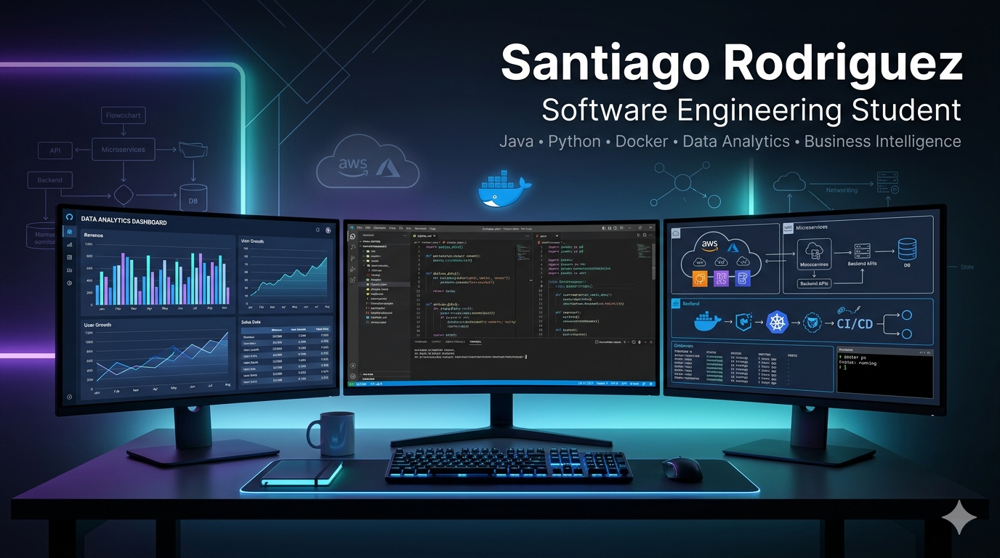

  

  

# Hi there 👋 I'm Santiago Rodriguez

### Software Engineering Student | Java & Python Developer | Data Analytics Enthusiast

---

## 🚀 About Me

🎓 Software Engineering Student

💻 Focused on Backend Development and Software Design

🐳 Working with Docker and Containerized Applications

📊 Interested in Data Analytics & Business Intelligence

🌱 Currently learning:

- Software Architecture
- Cloud Computing
- Advanced Java
- Data Engineering

---

## 🛠️ Tech Stack

  

---

## 🎯 Current Focus

- Backend Development with Java
- Python Applications
- Docker Containers
- Business Intelligence
- Data Analytics

---

## 📊 GitHub Analytics

---

## 🔥 Contribution Streak

---

## 📌 Featured Projects

### 🏢 Disko E.R.P.
Enterprise Resource Planning system designed for nightclub management.

### ☕ Backend Dobble
Backend application developed in Java following software engineering principles.

### 📊 Auroproces
Technical assessment notebook focused on data analysis and process automation using Python.

### 🔄 Middleware
Middleware implementation for web applications and service integration.

### 🌊 OceanGoal
Web-based project focused on modern frontend technologies and user experience.

### 💻 Distribuido Sprint
Java project applying distributed systems and software development concepts.

### 🎯 Open to internships, collaborative projects and software development opportunities.
---

## 🌎 Connect With Me

---

### 🚀 Always learning, always building.

